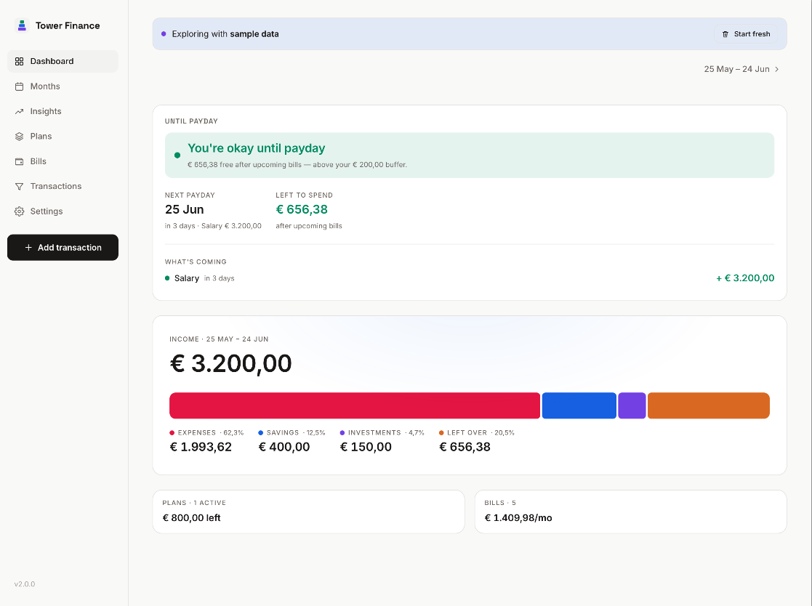
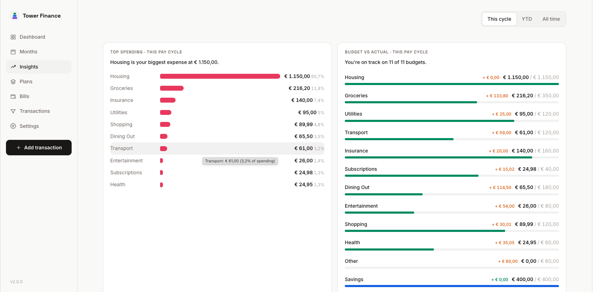
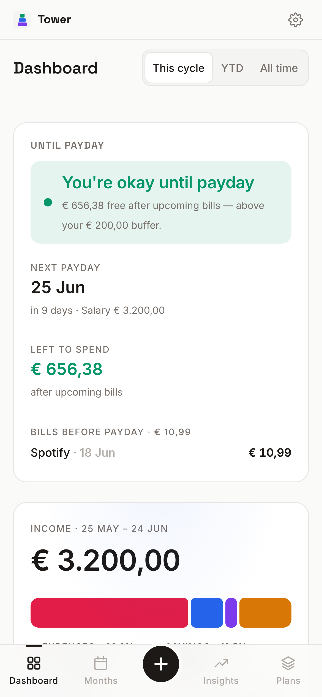
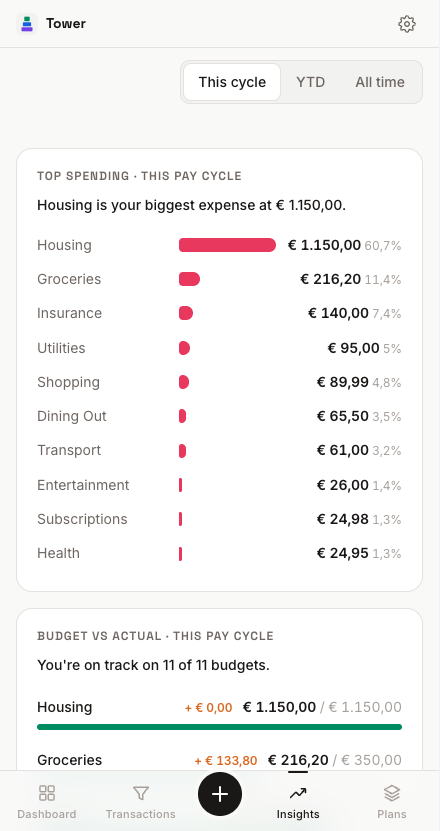
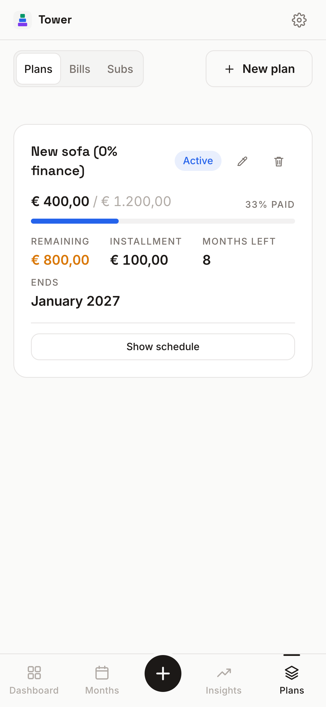

<h1 align="center">
  
  <br />
  Tower Finance
</h1>

**Self-hosted budgeting that follows your payday, not the calendar.**

[](LICENSE)
[](https://github.com/Blacksuite/tower-finance/actions/workflows/release.yml)
[](https://github.com/Blacksuite/tower-finance/pkgs/container/tower-finance)
[](https://ko-fi.com/blacksuite)

Tower Finance answers one question, at a glance: **am I going to be okay until
my next paycheck?** It opens with a single plain-language verdict — 🟢 okay,
🟡 tight, or 🔴 trouble — and the detail sits quietly below.

Most budget apps assume your month starts on the 1st. Real life starts when
your salary lands — the 26th, the 25th, the last Friday before a weekend. Tower
Finance budgets in **pay cycles** (payday → day before next payday) so your
income and the bills it pays always live in the same period.

It's a single small Docker container with one SQLite file. No cloud, no bank
logins, no accounts, no telemetry. Your financial data never leaves your
server. First launch walks you through a 30-second setup (your payday, your
salary, a safety buffer) and drops you on a working dashboard — or load the
sample data with one tap to look around first.

**Who it's for:** self-hosters who want full manual control over their money
picture — people replacing a spreadsheet, not chasing automatic bank sync.
Single user, single household, on a network you trust.

## Screenshots

The dashboard leads with the verdict; Insights and the pay-cycle views sit
quietly behind it. (Shown with the built-in sample data — load it any time from
the first-run screen or **Settings → Sample data**.)





<p>
  
  
  
</p>

## Why this exists

This started as a replacement for a personal Excel budget workbook. Spreadsheet
budgeting works, but every month means copying formulas, retyping fixed costs,
and squinting at rows. Tower Finance keeps the parts that made the spreadsheet
good — full manual control, everything visible, no magic imports — and
automates the rest.

## Features

- **Pay-cycle budgeting** — set your salary day and a weekend rule (previous
  Friday / exact / next Monday). Periods run payday to payday and are labeled
  by their real date range ("26 Jun – 25 Jul"). Default is plain calendar
  months if that's your thing.
- **Insights trends** — income allocation and savings rate, bucketed by your pay
  cycle so a paycheck lines up with the spending it funds (calendar months would
  strand them apart when payday isn't the 1st). The Months page keeps a
  calendar/cycle toggle for month-by-month reporting.
- **Fast manual entry** — quick-add sheet with a numeric keypad, category chips
  sorted by your usage, and reusable expense templates. Routine expense ≈ 3 taps.
- **Subscriptions** — define them once (monthly/quarterly/yearly); they count
  toward expenses and budgets automatically every cycle. Pausing keeps history.
- **Payment plans** — installment purchases with an auto-scheduling cascade:
  override any month's payment (including 0 to skip) and the rest of the
  schedule reflows; the final installment self-adjusts.
- **Budgets** — per-category budgets vs actuals as progress bars, monthly and
  YTD (scaled by the cycles you actually used), plus savings/investment targets.
- **Bills** — recurring or one-off expenses (rent, utilities, anything) with a
  flexible cadence and optional variable amounts; they flow into expenses,
  budgets and the payday verdict automatically.
- **History & filters** — every transaction filterable by cycle, week, month,
  year, custom range, category, and type.
- **Optional password protection** — scrypt-hashed password, httpOnly cookie
  sessions, login rate limiting, one-tap lock. Managed entirely in Settings; no
  environment variables. The API serves nothing without a valid session.
- **Installable PWA** — add it to your phone's home screen and it opens
  fullscreen like a native app. (Live data needs your server to be reachable —
  financial data is deliberately never cached in the browser.)
- **Backups you can trust** — everything is one SQLite file; one-click JSON
  export/import is built in.
- Dark + light theme, EUR/nl-NL defaults with configurable currency/locale,
  in-app update notifications.

## Quick start

Prebuilt image (recommended) — create a `docker-compose.yml`:

```yaml
services:
  tower-finance:
    image: ghcr.io/blacksuite/tower-finance:latest
    container_name: tower-finance
    ports:
      - "3210:3210"
    volumes:
      - ./data:/app/data
    restart: unless-stopped
```

```bash
docker compose up -d
```

Open `http://<server-ip>:3210` — that's it. See **[Updating](#updating)** when a
new version ships.

Or build from source:

```bash
git clone https://github.com/Blacksuite/tower-finance && cd tower-finance
docker compose up -d --build
```

Tower Finance is designed for a single user on a trusted network (home LAN,
VPN, or behind your own reverse proxy). If you expose it to the internet, put
it behind HTTPS and enable the password.

## Updating

Tower Finance is a Docker image, so updating is two commands:

```bash
docker compose pull        # fetch the latest image
docker compose up -d       # recreate the container
```

Your data is untouched — it lives in the `./data` volume — and schema migrations
run automatically on start. The running version is shown at the bottom of
Settings. Watchtower and Unraid's built-in update check also work for hands-off
updates.

**Pin a version / roll back.** Pin a tag instead of `:latest` in
`docker-compose.yml` (e.g. `image: ghcr.io/blacksuite/tower-finance:1.3.1`); to
roll back, set the previous tag and run `docker compose up -d` again. Building
from source instead? Update with `git pull && docker compose up -d --build`.

**Back up before a big jump (wise, not required).** Everything is one SQLite
file:

```bash
sqlite3 data/tower.db ".backup backups/tower-$(date +%F).db"
```

…or **Settings → Backup → Export JSON**. To restore: `docker compose down`, copy
the backup over `data/tower.db`, delete the stale `tower.db-wal` / `-shm` files,
then `docker compose up -d` — or **Import JSON** in the app.

> Forgot the app password? Remove the hash row and restart:
> `sqlite3 data/tower.db "DELETE FROM settings WHERE key='auth_hash'"`

## Your data

One SQLite database at `./data/tower.db`, mounted into the container. Back it
up by copying the file (`sqlite3 data/tower.db ".backup ..."` for a live copy)
or via Settings → Backup → Export JSON. Upgrades never touch the data volume
and schema migrations run automatically — see [Updating](#updating) for the
backup → update → rollback workflow.

## Development

```bash
npm install
npm run dev:server   # API on :3210 (SQLite in ./data)
npm run dev          # Vite dev server on :5173, proxies /api
npm test             # unit tests for the calculation engine + API + auth
npm run build        # production build (client + server + PWA icons)
```

React + Vite + TypeScript, Hono + better-sqlite3, Recharts, framer-motion.
All financial math lives in one pure, fully-tested module
(`src/shared/calc.ts`): pay-cycle mapping, the plan cascade, budget math, and
the payday verdict.

## Contributing & feedback

This is a young project and feedback shapes it. If you self-host it, I'd love to
hear what works and what doesn't.

- **Found a bug or have an idea?** Open an
  [issue](https://github.com/Blacksuite/tower-finance/issues).
- **Want to discuss or show your setup?** Start a
  [discussion](https://github.com/Blacksuite/tower-finance/discussions).
- **Pull requests welcome.** Keep financial logic in `src/shared/` with tests
  (`npm test`), and run `npm run lint` before opening a PR.

No telemetry means I can't see how it's used — so a one-line "it works on my
Synology" is genuinely useful.

If Tower Finance saves you a budgeting-app subscription, you can buy me a
coffee on [Ko-fi](https://ko-fi.com/blacksuite). Never asked for, always
appreciated.

## License

[MIT](LICENSE) — free and open source. Self-host it, fork it, make it yours.
